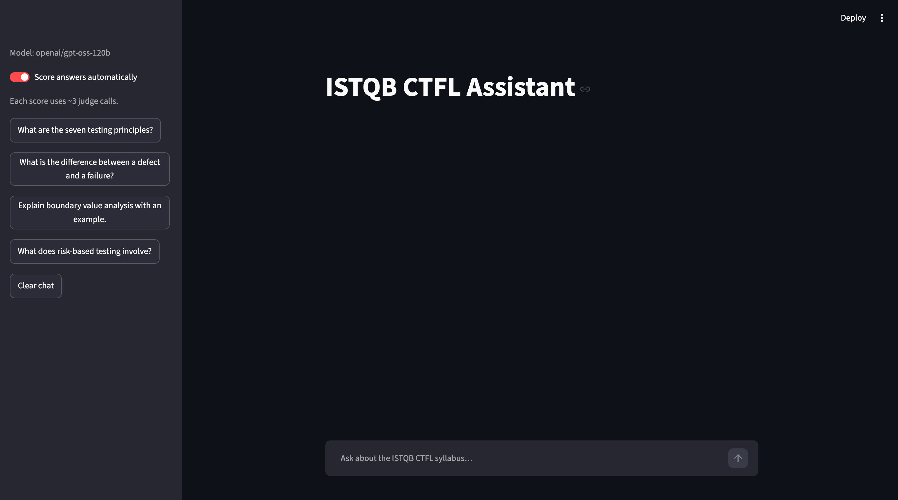
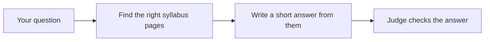

# ISTQB Study Assistant

[](https://github.com/Yusuf-Hridoy/istqb-rag-eval/actions/workflows/ci.yml)

Ask any question about the ISTQB Foundation Level syllabus and get a short answer,
the exact page it came from, and an AI judge's verdict on whether you can trust it.



## What it does

- **Answers only from the official syllabus.** No guessing from general knowledge.
- **Shows its source.** Every answer cites the syllabus page, and you can read the
  exact text it used.
- **Checks itself.** An AI judge scores each answer: *faithfulness* (is every claim
  backed by the source?) and *relevance* (does it answer the question?). You see
  **OK** or **Check this answer**.
- **Stays on topic.** Ask about cooking or try to trick it, and it politely refuses.

## Try it

You need:
- Python 3.13 and [uv](https://docs.astral.sh/uv/getting-started/installation/)
- A free Groq API key from [console.groq.com/keys](https://console.groq.com/keys)
- The ISTQB CTFL v4.0 syllabus PDF from [istqb.org](https://www.istqb.org), saved as
  `data/raw/ctfl_syllabus_v4.pdf`

Then run:

```bash
uv sync
cp .env.example .env                  # add your GROQ_API_KEY
uv run python -m istqb_rag.ingest     # reads the syllabus once (about a minute)
uv run streamlit run app/streamlit_app.py
```

Your browser opens the assistant. Try *"What is the difference between a defect
and a failure?"*

## How it works



The syllabus is split into small pieces and indexed once. For each question the
assistant finds the most relevant pieces, writes an answer using only those, and
cites the pages. A second AI model then grades the answer.

## How I tested it

I treated the assistant like software under test: 15 test questions with known
correct answers, scored by an AI judge using [Ragas](https://docs.ragas.io), with
experiments run like controlled tests. What I found:

- **Same question, same settings, different answers.** Even at temperature 0, 11 of
  15 answers changed between two identical runs, so one test run proves little.
- **My best idea made it worse.** Splitting the syllabus by section was supposed to
  help; it found the right page less often (100% → 82%).
- **A "win" turned out to be luck.** A change looked like it fixed two bugs, but
  re-running the old version showed the same result. Repeating each version 4 times
  revealed the real benefit: consistency, not a higher score.
- **One known weak spot:** long lists, like "the seven testing principles", get
  split across pieces, so the assistant may say it can't find the answer.

Full write-up: [findings](docs/findings.md) · numbers: [results](docs/results.md)

## Limitations

- Small test set (15 questions), so results are indicative, not conclusive.
- The judge is also an AI and can be wrong; treat its verdict as a strong hint.
- Answers only what's in the ISTQB Foundation syllabus v4.0.

## For developers

- Run an evaluation: `uv run python -m istqb_rag.eval all --run-id my-run`, then
  open `runs/my-run/report.md`
- Compare two runs: `uv run python -m istqb_rag.eval compare --base pilot-1 --new my-run`
- Run the tests: `uv run pytest -q`
- Design decisions: [DECISIONS.md](DECISIONS.md) · variance study:
  [answer-variance.md](docs/answer-variance.md)

| Folder | What's inside |
|---|---|
| `app/` | The chat app |
| `src/istqb_rag/` | Reading the syllabus, finding pages, writing answers |
| `src/istqb_rag/eval/` | The evaluation: test questions, judging, reports |
| `data/` | The test questions (the syllabus itself is not included) |
| `runs/` | One folder per evaluation run, each with a readable `report.md` |
| `docs/` | Findings and detailed results |
