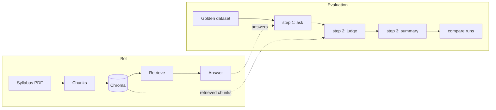

# istqb-rag-eval

[](https://github.com/Yusuf-Hridoy/istqb-rag-eval/actions/workflows/ci.yml)

An ISTQB-syllabus RAG assistant, built to be evaluated with Ragas and tested
like software.

## Key findings

Detail for all four: [findings.md](docs/findings.md).

- **`temperature=0` did not make answers repeat.** Identical runs retrieved the
  same chunks on 15/15 rows but gave 11/15 different answers; only 4/15 rows
  repeated across four runs.
- **A predicted improvement made things worse.** Section chunking dropped page
  hit rate 1.000 → 0.818 and context recall 0.778 → 0.667 (n=11), and did not
  fix the question it was built for.
- **An apparent win was not credited.** Structured answers lifted citation rate
  0.800 → 1.000 (n=10) and out-of-scope accuracy 0.500 → 1.000 (n=2) — but the
  unchanged baseline, re-run, reproduced both.
- **A pre-registered rule settled it anyway.** Over 4 runs each, text mode's
  out-of-scope accuracy ranged 0.500–1.000 (n=2); structured never flipped a
  status. `ANSWER_FORMAT` now defaults to `structured`, for stable *recorded*
  status and citations — not stabler prose.

## Screenshots


## How it works



The bot retrieves the top `TOP_K` chunks, refuses if none clears a relevance
floor, and otherwise answers with page citations. The evaluation runs that same
`answer()` over a golden dataset in three separable steps, so answers are
generated once and re-scored without re-asking.

## Results

Generated by `uv run python -m istqb_rag.eval readme-tables`; CI fails if the
README differs from the run files. Every run below used answer prompt
version 1; the current default is version 2.

### Baseline

<!-- results:baseline:start -->
Run `pilot-1` — 15 rows, judged by `qwen/qwen3.8-27b`.

| Metric | Mean | Rows scored (n) | NaN (parse / truncated) |
|---|---|---|---|
| Context precision | 0.770 | 11 | 0 / 0 |
| Context recall | 0.778 | 11 | 0 / 0 |
| Faithfulness | 0.841 | 8 | 0 / 2 |
| Response relevancy | 0.869 | 10 | 0 / 0 |

In-scope answer rate 0.909 (10/11) · errors 0 · latency median 8829 ms, p95 12021 ms.
<!-- results:baseline:end -->

### Experiments

<!-- results:experiments:start -->
| metric | baseline<br>`pilot-1` | control, same config<br>`pilot-1-repeat` | section chunking<br>`exp1-section-chunking` | structured answers<br>`exp2-structured-answers` |
|---|---|---|---|---|
| Context recall | 0.778 (n=11) | not re-judged | 0.667 (n=11) | not re-judged |
| Page hit rate | 1.000 (n=11) | 1.000 (n=11) | 0.818 (n=11) | 1.000 (n=11) |
| Citation rate | 0.800 (n=10) | 1.000 (n=10) | 1.000 (n=10) | 1.000 (n=10) |
| Citation validity | 1.000 (n=8) | 1.000 (n=10) | 1.000 (n=10) | 1.000 (n=10) |
| Out-of-scope accuracy | 0.500 (n=2) | 1.000 (n=2) | 1.000 (n=2) | 1.000 (n=2) |
<!-- results:experiments:end -->

### Answer variance

<!-- results:variance:start -->
Mean across 4 runs of each mode, with (min–max).

| metric | text (4 runs) | structured (4 runs) |
|---|---|---|
| Citation rate | 0.925 (0.800–1.000) | 1.000 (1.000–1.000) |
| Out-of-scope accuracy | 0.750 (0.500–1.000) | 1.000 (1.000–1.000) |
| Not-in-syllabus accuracy | 1.000 (1.000–1.000) | 1.000 (1.000–1.000) |
| Answer rate | 0.909 (0.909–0.909) | 0.909 (0.909–0.909) |
| Format fallbacks (total) | 0 | 0 |
| Rows with an identical answer every run | 4 of 15 | 3 of 15 |

Status flips across runs — text: `q072`; structured: none.

Decision rule (written before the runs): **default = `structured`**.
<!-- results:variance:end -->

## Quick start

Needs [uv](https://docs.astral.sh/uv/), Python 3.13, and the syllabus PDF at
`data/raw/ctfl_syllabus_v4.pdf` (never downloaded automatically).

```bash
uv sync
cp .env.example .env                                    # then add GROQ_API_KEY
uv run python -m istqb_rag.ingest                       # build the vector store
uv run streamlit run app/streamlit_app.py               # chat + eval dashboard
uv run python -m istqb_rag.eval all --run-id my-run     # ask, judge, summarise
uv run pytest -q && uv run ruff check .                 # offline tests and lint
```

## Project structure

| Path | What it holds |
|---|---|
| `src/istqb_rag/` | The pipeline: config, ingestion, retrieval and answering. |
| `src/istqb_rag/eval/` | The evaluation: dataset, the three steps, metrics and run comparison. |
| `app/` | Streamlit chat tab, eval dashboard and run comparison. |
| `data/` | The golden dataset and human labels. The syllabus and its extracted text are gitignored. |
| `runs/` | One directory per eval run: config, scores and summary. Full answers are gitignored. |
| `docs/` | Findings, the variance study, the dataset review and the failure taxonomy. |
| `scripts/` | The CI results-integrity check. |
| `tests/` | Offline tests — no API keys, no network, no PDF. |

## Limitations

- **The baseline is n=15**, so per-group means rest on one to three rows and are
  flagged "n too small".
- **The dataset is LLM-drafted and LLM-verified**, not human-verified. *Not yet
  done:* human calibration — `data/human_labels.csv` is unfilled, so one row has
  no failure type and judge-vs-human agreement is uncomputed.
- **One judge, free tier, output-capped.** Two faithfulness verdicts were lost to
  truncation; they are reported separately, not averaged away.
- **Judge variance unmeasured.** *Not yet done:* re-score saved answers several
  times — costs no answer-model calls.
- **CI cannot verify scores** (no PDF, no keys); it guards code quality and the
  honesty of published results.

**More detail:** [findings.md](docs/findings.md) ·
[answer-variance.md](docs/answer-variance.md) · [DECISIONS.md](DECISIONS.md)
