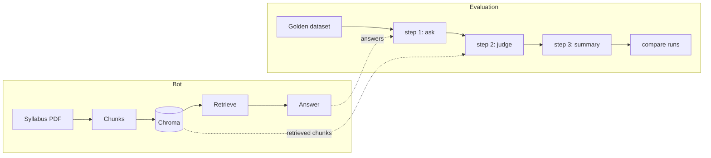

# istqb-rag-eval

[](https://github.com/Yusuf-Hridoy/istqb-rag-eval/actions/workflows/ci.yml)

An ISTQB-syllabus RAG assistant, built to be evaluated with Ragas and tested
like software.

## Key findings

- **`temperature=0` did not make answers repeat.** Two runs of an identical
  configuration retrieved the same chunks on **15 of 15** rows but produced
  **11 of 15** different answers. Over four runs per mode, only **4 of 15**
  rows (text) and **3 of 15** (structured) gave the same answer every time.
  Every answer-side number in this project is one sample, not a constant.
  → [answer-variance.md](docs/answer-variance.md)
- **A predicted improvement made things worse.** Section-aware chunking was
  predicted to raise retrieval on multi-chunk rows. Page hit rate fell
  **1.000 → 0.818 (n=11)** and context recall **0.778 → 0.667 (n=11)**. The
  question it was built for, q007, did not change at all.
  → [phase-3-findings.md](docs/phase-3-findings.md)
- **An apparent win was not credited.** Structured answers lifted citation rate
  0.800 → 1.000 and out-of-scope accuracy 0.500 → 1.000 — but re-running the
  **unchanged** baseline reproduced both. The gain was run-to-run variation, so
  the format was not credited for it.
  → [phase-3-findings.md §3a](docs/phase-3-findings.md)
- **A pre-registered rule then settled it on different grounds.** Across 4 runs
  each, structured mode never recorded a scope row as answered and never flipped
  a status, while text mode's out-of-scope accuracy ranged **0.500–1.000**. All
  three conditions of the rule were met, so `ANSWER_FORMAT` now defaults to
  `structured` — for stability of the *recorded* status and citations, not
  because the prose improved.
  → [answer-variance.md](docs/answer-variance.md)

## Screenshots


## How it works



The bot retrieves the top `TOP_K` chunks for a question, refuses if nothing
clears a relevance floor, and otherwise answers from those chunks with page
citations. The evaluation runs the same `answer()` over a golden dataset in
three separable steps — ask, judge, summarise — so answers are generated once
and can be re-scored without re-asking, and any two runs can be compared row by
row on their question ids.

## Results

Every table below is **generated from the run files** by
`uv run python -m istqb_rag.eval readme-tables`, and CI fails if the README
differs from what the run files produce.

### Baseline

<!-- results:baseline:start -->
Run `pilot-1` — 15 rows, judged by `qwen/qwen3.8-27b`.

| Metric | Mean | Rows scored (n) | NaN (parse / truncated) |
|---|---|---|---|
| Context precision | 0.770 | 11 | 0 / 0 |
| Context recall | 0.778 | 11 | 0 / 0 |
| Faithfulness | 0.841 | 8 | 0 / 2 |
| Response relevancy | 0.869 | 10 | 0 / 0 |

In-scope answer rate 0.909 (10/11) · errors 0 · latency median 8829 ms, p95 12021 ms.
<!-- results:baseline:end -->

### Experiments

<!-- results:experiments:start -->
| metric | baseline<br>`pilot-1` | control, same config<br>`pilot-1-repeat` | section chunking<br>`exp1-section-chunking` | structured answers<br>`exp2-structured-answers` |
|---|---|---|---|---|
| Context recall | 0.778 (n=11) | not re-judged | 0.667 (n=11) | not re-judged |
| Page hit rate | 1.000 (n=11) | 1.000 (n=11) | 0.818 (n=11) | 1.000 (n=11) |
| Citation rate | 0.800 (n=10) | 1.000 (n=10) | 1.000 (n=10) | 1.000 (n=10) |
| Citation validity | 1.000 (n=8) | 1.000 (n=10) | 1.000 (n=10) | 1.000 (n=10) |
| Out-of-scope accuracy | 0.500 (n=2) | 1.000 (n=2) | 1.000 (n=2) | 1.000 (n=2) |
<!-- results:experiments:end -->

### Answer variance

<!-- results:variance:start -->
Mean across 4 runs of each mode, with (min–max).

| metric | text (4 runs) | structured (4 runs) |
|---|---|---|
| Citation rate | 0.925 (0.800–1.000) | 1.000 (1.000–1.000) |
| Out-of-scope accuracy | 0.750 (0.500–1.000) | 1.000 (1.000–1.000) |
| Not-in-syllabus accuracy | 1.000 (1.000–1.000) | 1.000 (1.000–1.000) |
| Answer rate | 0.909 (0.909–0.909) | 0.909 (0.909–0.909) |
| Format fallbacks (total) | 0 | 0 |
| Rows with an identical answer every run | 4 of 15 | 3 of 15 |

Status flips across runs — text: `q072`; structured: none.

Decision rule (written before the runs): **default = `structured`**.
<!-- results:variance:end -->

## The experiments

**Baseline (`pilot-1`, n=15).** 15 reviewed rows from a 75-row golden dataset,
judged by a different model family from the one that answers. It established the
numbers everything else is compared against, and surfaced the failures the
experiments then targeted. → [phase-2-findings.md](docs/phase-2-findings.md)

**Experiment 1 — section-aware chunking.** Predicted: context recall on
multi-chunk rows rises and q007 becomes answered; risk noted in advance that
longer chunks reach fewer pages. What happened: recall fell on both groups, page
hit rate fell, and q007 was unchanged. Retrieval *did* find the right section —
its top hit became the Testing Principles chunk — but that section is longer
than `CHUNK_SIZE` and gets split anyway, so the retrieved piece still held one
principle. The stated risk is what materialised. Not adopted.

**Experiment 2 — structured answers.** Predicted: out-of-scope accuracy rises
and citation rate reaches 100%. Both numbers were met, and both were then
reproduced by a control run with no change at all, so they are not evidence
about the format. What does hold is mechanistic: the model states its own status
instead of having it inferred by matching its prose against two fixed sentences,
so a refusal phrased in the model's own words can no longer be filed as an
answer.

**The control run (`pilot-1-repeat`).** The baseline configuration re-run
unchanged. It exists because Experiment 1 — which never touched the answer
format — also reached citation rate 1.000, which made Experiment 2's gains
suspect. It reproduced them, and in doing so exposed that the answer model is
not deterministic at `temperature=0`.

**The variance study.** Four runs of each answer format, with the decision rule
written before any of them and applied as written. It measured the spread the
control run implied: text mode's citation rate ranges 0.800–1.000 and its
out-of-scope accuracy 0.500–1.000, driven entirely by one row (`q072`) flipping
between `answered` and `refused`. Structured mode never moved on either.

## Limitations

- **The pilot is n=15.** Per-chapter and per-K-level means rest on one to three
  rows each and are reported as "n too small" rather than discussed.
- **The dataset is LLM-drafted and LLM-verified**, not human-verified. Each of
  the 15 pilot rows was checked against its syllabus pages by the model, and
  carries `reviewed_by: llm`. → [dataset-review.md](docs/dataset-review.md)
- **Human calibration was not performed.** `data/human_labels.csv` was never
  filled in, so judge-vs-human agreement, Cohen's kappa and the confusion matrix
  are not computed, and one row (`q027`) has no failure type assigned. The code
  and its tests are in place, unused.
- **One judge model, free tier, with an output cap.** `JUDGE_MAX_TOKENS=950`
  keeps requests under a 1000-output-tokens-per-minute ceiling; two faithfulness
  verdicts were lost to truncation and are reported separately from parse
  failures rather than averaged away.
- **Judge variance was not measured.** The judge runs at temperature 0 and
  repeated one truncation identically, which is suggestive but not a measurement.
- **The answer model is not deterministic at `temperature=0`** (see Key
  findings), so single-run answer-side comparisons carry unknown noise.

## Setup

Requires [uv](https://docs.astral.sh/uv/) and Python 3.13.

```bash
uv sync
cp .env.example .env          # then add GROQ_API_KEY
```

The syllabus PDF is never downloaded automatically. Download the ISTQB CTFL v4.0
syllabus and save it as `data/raw/ctfl_syllabus_v4.pdf`.

```bash
uv run python -m istqb_rag.ingest                 # build the vector store
uv run python -m istqb_rag.cli "What is testing?" # ask one question
uv run streamlit run app/streamlit_app.py         # chat + eval dashboard
```

### Running the evaluation

```bash
uv run python -m istqb_rag.eval all   --run-id my-run      # ask, judge, summarise
uv run python -m istqb_rag.eval quick --run-id my-run      # judge-free metrics only
uv run python -m istqb_rag.eval compare --base pilot-1 --new my-run
uv run python -m istqb_rag.eval readme-tables              # regenerate the tables above
```

Both stages resume: rerun the same command after a crash or a rate limit and it
picks up where it stopped.

### Tests and lint

```bash
uv run pytest -q
uv run ruff check . && uv run ruff format --check .
uv run python scripts/check_results_integrity.py
```

All tests are offline — no API keys, no network, no PDF. CI has neither the
syllabus nor any API key, so it cannot build the index or reproduce a score;
the gate protects **code quality and the honesty of the published results**, not
the scores themselves.

## Project map

| Path | What it is for |
|---|---|
| `src/istqb_rag/config.py` | Reads settings from `.env` (models, chunk size, `TOP_K`, paths, the two experiment switches). |
| `src/istqb_rag/ingest.py` | Turns the syllabus PDF into chunks and loads them into Chroma. `--chunking page\|section`. |
| `src/istqb_rag/pipeline.py` | The RAG pipeline: `answer(question)` retrieves, generates and cites. |
| `src/istqb_rag/prompts.py` | Every prompt and fixed reply, kept in one place. |
| `src/istqb_rag/result_types.py` | The result objects passed around: `RetrievedChunk` and `RagResult`. |
| `src/istqb_rag/structured_answer.py` | Parses the model's JSON reply in structured mode, and falls back safely. |
| `src/istqb_rag/cli.py` | Ask one question from the terminal. |
| `src/istqb_rag/eval/dataset.py` | Loads and validates the golden dataset, and checks its mix. |
| `src/istqb_rag/eval/step1_ask_questions.py` | Ask every dataset question, save the answers. |
| `src/istqb_rag/eval/step2_judge_scores.py` | The judge scores those saved answers. |
| `src/istqb_rag/eval/step3_build_summary.py` | Adds the scores up into `summary.json` and a console table. |
| `src/istqb_rag/eval/deterministic_metrics.py` | Citation rate, citation validity, page hit rate, Cohen's kappa — no judge. |
| `src/istqb_rag/eval/compare_runs.py` | Joins two runs on question id and reports every difference. |
| `src/istqb_rag/eval/answer_variance.py` | Spread, status flips and answer stability across repeated runs. |
| `src/istqb_rag/eval/readme_tables.py` | Generates this README's results tables from the run files. |
| `src/istqb_rag/eval/human_labeling_sheet.py` | Builds the human reading sheet and the empty labels file. |
| `src/istqb_rag/eval/__main__.py` | The eval commands. Keeps this name because `python -m` requires it. |
| `app/streamlit_app.py` | Chat tab, eval dashboard, and run comparison. |
| `data/golden_dataset.jsonl` | The 75 evaluation questions with reference answers. |
| `data/human_labels.csv` | Human faithfulness labels (ids only, no syllabus text). |
| `data/raw/`, `data/processed/` | Syllabus PDF and extracted page text. Gitignored — syllabus text is never committed. |
| `runs/<id>/config.json` | What the run used: models, `TOP_K`, chunk size, which metrics were judged. |
| `runs/<id>/scores.csv` | One line per question: ids, status, scores. No question, answer or syllabus text. |
| `runs/<id>/summary.json` | The aggregated results the README tables and dashboard read. |
| `runs/<id>/answers.jsonl` | Full answers including syllabus text. Gitignored, never committed. |
| `runs/example-fake-data/` | Invented numbers so the dashboard renders on a fresh clone. Not a measurement. |
| `scripts/check_results_integrity.py` | The CI gate on published results. |
| `docs/` | Findings, the dataset review, the failure taxonomy and the variance study. |
| `DECISIONS.md` | Why things are the way they are, including what was measured rather than assumed. |
| `tests/conftest.py` | Shared fakes for the offline tests. Keeps this name because pytest requires it. |

## Next steps

- **Human calibration** — fill `data/human_labels.csv` and compute judge-vs-human
  agreement, which also settles `q027`'s failure type.
- **A longer-context embedding model**, so a whole syllabus section can be
  embedded without being split. `bge-small-en-v1.5` has a 512-token window,
  which is why whole-section chunking was not attempted.
- **A judge variance run** — re-score the same saved answers several times.
  `answers.jsonl` is kept, so this costs no answer-model calls.
- **Expand from 15 to 60 reviewed rows**, so per-chapter and per-K-level
  breakdowns stop being too thin to read.
